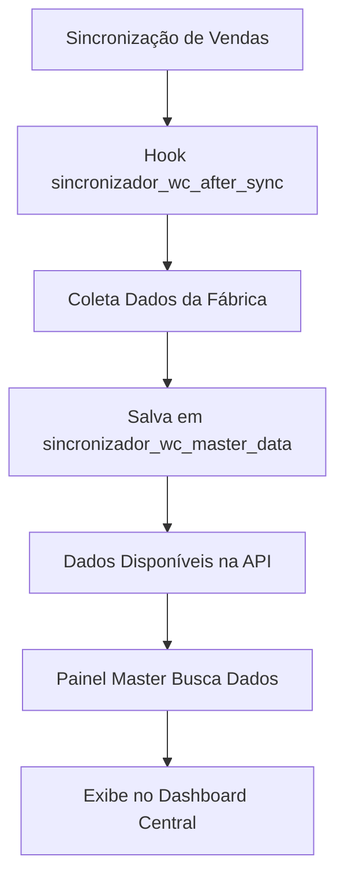

# 🚀 Master API - Integração com Painel Master

## 📋 Visão Geral

A Master API foi criada para permitir que o **Plugin Painel Master** consuma dados do plugin **Sincronizador WooCommerce** de forma centralizada. Agora, quando as vendas são sincronizadas, os dados são automaticamente salvos e disponibilizados via API REST.

## 🔄 Como Funciona a Integração

### 1. **Sincronização Automática de Dados**
- ✅ Quando uma sincronização de produtos é realizada, o hook `sincronizador_wc_after_sync` é disparado
- ✅ Os dados da fábrica são coletados e salvos em `sincronizador_wc_master_data`
- ✅ A Master API expõe esses dados via endpoints REST

### 2. **Hooks Implementados**
```php
// Disparado após sincronização completa
do_action('sincronizador_wc_after_sync', $lojista_nome, $dados_sync);

// Disparado para cada produto sincronizado
do_action('sincronizador_wc_produto_sincronizado', $lojista_nome, $produto_id, $dados_produto);
```

### 3. **Endpoints da API Master**

| Endpoint | Método | Descrição |
|----------|--------|-----------|
| `/wp-json/sincronizador-wc/v1/master/health` | GET | Health check da API |
| `/wp-json/sincronizador-wc/v1/master/fabrica-status` | GET | Status geral da fábrica |
| `/wp-json/sincronizador-wc/v1/master/revendedores` | GET | Dados detalhados dos lojistas |
| `/wp-json/sincronizador-wc/v1/master/produtos-top` | GET | Produtos mais vendidos |

## 🔑 Autenticação

A API utiliza **Bearer Token** para autenticação:

```http
Authorization: Bearer sync_abc123456789
```

### Gerar Novo Token
1. Acesse **Sincronizador WC > Configurações**
2. Clique em **"🔄 Gerar Novo Token"**
3. Use o token gerado no Plugin Painel Master

## 📊 Estrutura de Dados

### Endpoint: `/fabrica-status`
```json
{
  "success": true,
  "data": {
    "fabrica_nome": "Minha Fábrica Ltda",
    "fabrica_url": "https://fabrica.com.br",
    "status": "ativo",
    "total_lojistas": 5,
    "lojistas_ativos": 4,
    "total_produtos": 150,
    "vendas_mes_atual": {
      "total_vendas": "R$ 25.480,00",
      "total_pedidos": 89,
      "crescimento": "+15%"
    },
    "ultima_atualizacao": "2024-01-18 14:30:25"
  }
}
```

### Endpoint: `/revendedores`
```json
{
  "success": true,
  "data": [
    {
      "id": 1,
      "nome": "Loja Centro",
      "url": "https://lojacentro.com.br",
      "status": "ativo",
      "ultima_sync": "2024-01-18 10:15:00",
      "produtos_sincronizados": 98,
      "vendas_mes": {
        "total": "R$ 8.950,00",
        "pedidos": 35
      }
    }
  ]
}
```

### Endpoint: `/produtos-top`
```json
{
  "success": true,
  "data": [
    {
      "id": 101,
      "nome": "Camiseta Polo Azul",
      "sku": "CAM-POLO-AZ",
      "vendas_total": 245,
      "preco": "R$ 59,90",
      "estoque": 50,
      "categoria": "Roupas"
    }
  ]
}
```

## 🔧 Como o Painel Master Consome os Dados

### 1. **Configuração no Painel Master**
```php
// Configurações da fábrica
$fabrica_config = array(
    'nome' => 'Minha Fábrica',
    'url' => 'https://fabrica.com.br',
    'token' => 'sync_abc123456789',
    'intervalo_atualizacao' => 300 // 5 minutos
);
```

### 2. **Buscar Dados da Fábrica**
```php
// Exemplo de como o Painel Master busca os dados
function buscar_dados_fabrica($config) {
    $url = $config['url'] . '/wp-json/sincronizador-wc/v1/master/fabrica-status';
    
    $response = wp_remote_get($url, array(
        'headers' => array(
            'Authorization' => 'Bearer ' . $config['token'],
            'Content-Type' => 'application/json'
        )
    ));
    
    if (!is_wp_error($response)) {
        $data = json_decode(wp_remote_retrieve_body($response), true);
        return $data;
    }
    
    return false;
}
```

### 3. **Processamento e Exibição**
```php
// Como o Painel Master processaria os dados
$dados_fabrica = buscar_dados_fabrica($fabrica_config);

if ($dados_fabrica && $dados_fabrica['success']) {
    $info = $dados_fabrica['data'];
    
    echo "<h3>{$info['fabrica_nome']}</h3>";
    echo "<p>Status: {$info['status']}</p>";
    echo "<p>Lojistas Ativos: {$info['lojistas_ativos']}/{$info['total_lojistas']}</p>";
    echo "<p>Vendas do Mês: {$info['vendas_mes_atual']['total_vendas']}</p>";
}
```

## 📈 Fluxo de Atualização dos Dados



## 🎯 Benefícios da Integração

### ✅ **Para a Fábrica**
- Visão centralizada de todas as lojas
- Monitoramento em tempo real das sincronizações
- Dados de vendas consolidados
- Controle de estoque unificado

### ✅ **Para o Painel Master**
- Acesso a dados de múltiplas fábricas
- API padronizada e confiável
- Autenticação segura via token
- Dados sempre atualizados

### ✅ **Para os Lojistas**
- Transparência nas vendas para a fábrica
- Sincronização mais eficiente
- Melhor suporte da fábrica

## 🔒 Segurança

- ✅ **Autenticação via Bearer Token**
- ✅ **Tokens únicos por instalação**
- ✅ **Verificação de permissões**
- ✅ **Logs de acesso**

## 📝 Logs e Monitoramento

Os seguintes eventos são registrados:

```php
// Logs automáticos
error_log("Master API: Dados atualizados após sincronização com {$lojista_nome}");
error_log("Master API: Venda sincronizada - Lojista: {$lojista_nome}, Produto: {$produto_id}");
error_log("Master API: Acesso ao endpoint {$endpoint} com token {$token_hash}");
```

## 🚀 Próximos Passos

1. **✅ Implementação Concluída**
   - Master API criada e funcionando
   - Hooks de sincronização implementados
   - Endpoints REST configurados
   - Autenticação via token ativa

2. **🔄 Em Produção**
   - Teste com lojistas reais
   - Monitoramento de performance
   - Ajustes conforme necessário

3. **📈 Melhorias Futuras**
   - Cache de dados para performance
   - Webhooks para atualizações em tempo real
   - Dashboard visual na fábrica
   - Relatórios avançados

## 📞 Suporte

Para configurar a integração com o Painel Master:

1. **Token de Acesso**: Disponível em Configurações
2. **URL Base**: `{sua-fabrica}/wp-json/sincronizador-wc/v1/master/`
3. **Documentação**: Este arquivo
4. **Testes**: Use os arquivos `test-master-api.php` e `test-painel-master.php`

---
**Desenvolvido por**: Moterle Andrei  
**Versão**: 1.1.0  
**Data**: Janeiro 2024
